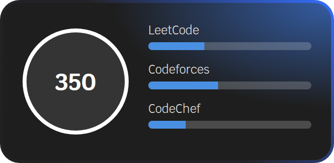
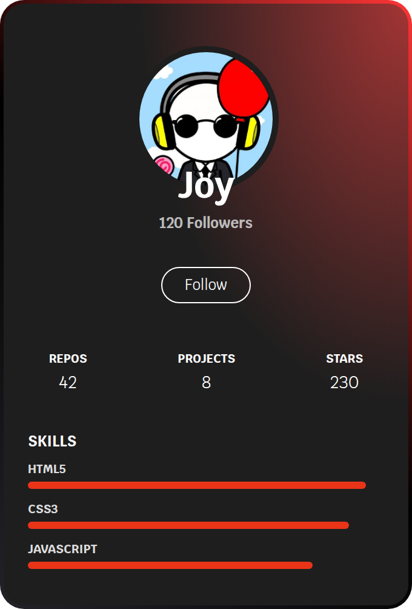
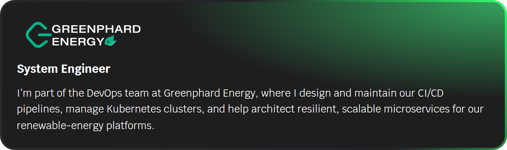
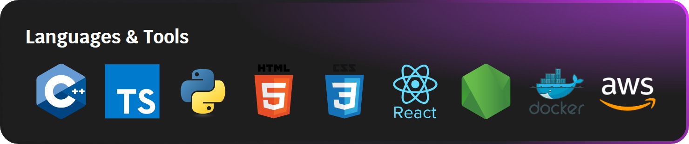

# Hi there 👋, I'm Joy

<table>
<tr>
  <!-- LEFT: About Me + Platforms -->
  <td valign="top" width="50%" style="padding-right:20px;">
    <h2>👨‍💻 About Me</h2>
    

    

      I’m a <strong>System Engineer &amp; Fullstack Developer</strong> 
      with a passion for building robust, scalable applications and optimizing system architecture. 
      I love tackling challenging problems and learning new technologies along the way.
    

    

      🌱 Currently learning <strong>Kubernetes &amp; GraphQL</strong> 
      💬 Ask me about <strong>DevOps, System Design &amp; Web Development</strong> 
      📫 How to reach me: j2612200@gmail.com
    

    

      I’m also learning Data Structures and Algorithms 👩🏻‍💻
    

    

      
    

  </td>

  <!-- RIGHT: Profile Card -->
  <td valign="top" width="50%" style="padding-left:20px;">
    
  </td>
</tr>

<tr>
  <!-- GREEN INFO CARD full width -->
  <td colspan="2" align="center" style="padding-top:20px;">
    
  </td>
</tr>

<tr>
  <!-- LANGUAGES & TOOLS CARD full width -->
  <td colspan="2" align="center" style="padding-top:20px;">
    
  </td>
</tr>
</table>

---

## 🔗 Find me on

  &nbsp;
  &nbsp;
  

